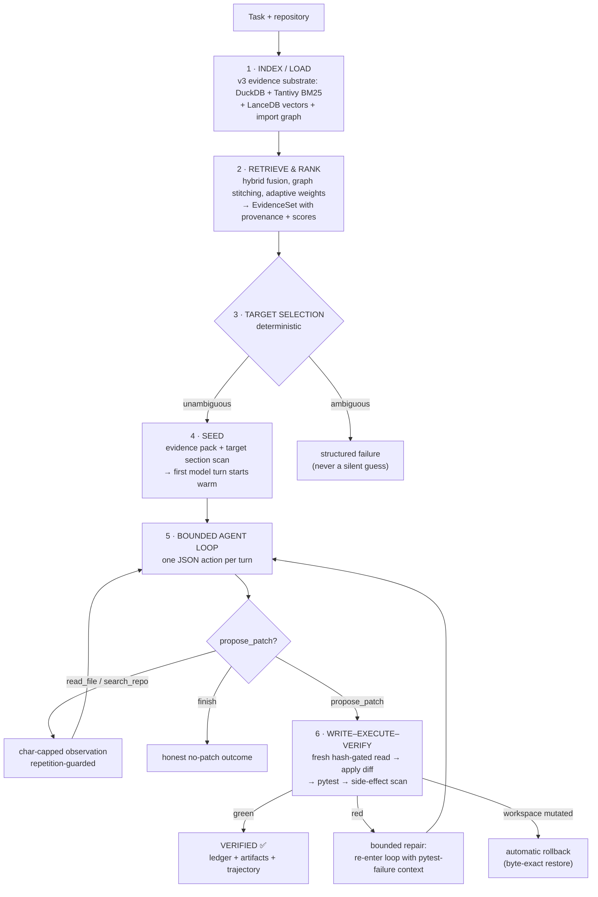
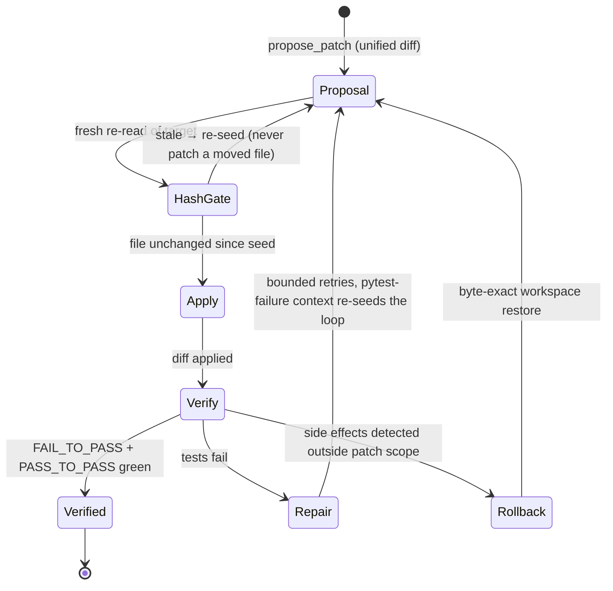
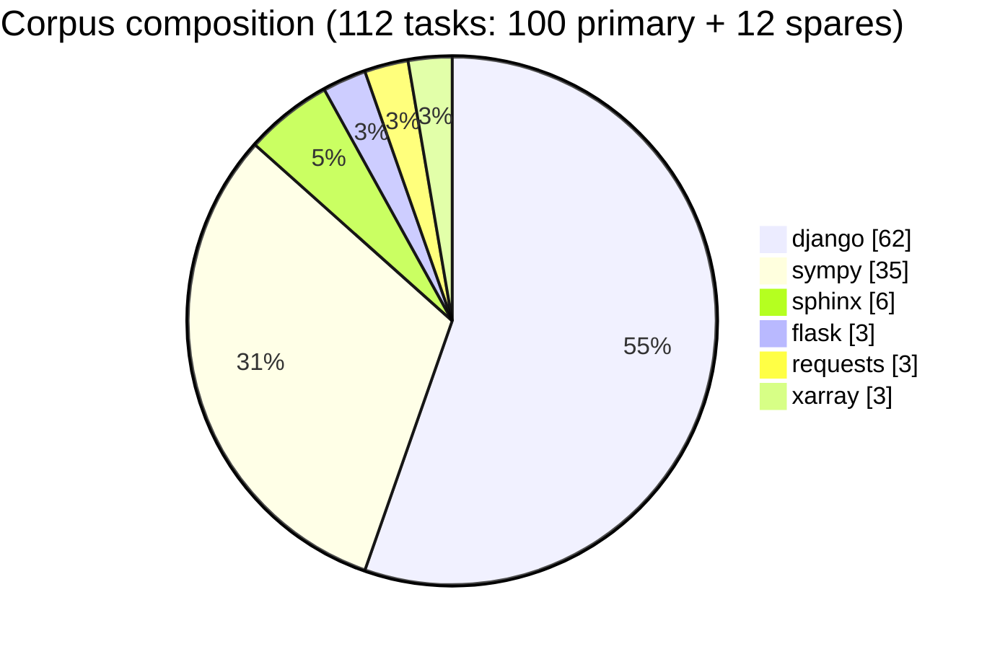

# HOM-LLM

**A retrieval-first coding agent — built on one bet: that most of what agentic
systems do with tokens, a good evidence layer should do with indexes.**

- `src/homllm/` — **v3**, the production read-only RAG engine (~192 modules,
  ~42K lines): indexing, hybrid retrieval, ranking, token-budgeted context
  assembly, and quality diagnostics. It answers questions about a repository
  and it answers them *grounded*.
- `src/homllm_v4/` — **v4**, built **beside** v3 (never inside it — v3 is
  reachable only through `src/homllm_v4/adapters/`). v4 adds the half v3 was
  architecturally forbidden to do: **write, execute, verify** — as a bounded,
  evidence-seeded, model-driven tool loop.

> **Thesis under test:** an agent whose every turn starts from
> retrieval-seeded, ranked, budgeted evidence should match frontier-agent task
> completion at a fraction of the token cost. We are measuring this against
> SWE-bench Lite with a harness we first prove can score fairly. The
> measurement campaign is in progress — the results below are the honest,
> partial ones.

---

## Table of contents

1. [Why we are building this](#1-why-we-are-building-this)
2. [The thesis, drawn](#2-the-thesis-drawn)
3. [The life of a task](#3-the-life-of-a-task)
4. [Design principles](#4-design-principles)
5. [Architecture](#5-architecture)
6. [The write–execute–verify lifecycle](#6-the-writeexecuteverify-lifecycle)
7. [The benchmark, and why we certify the harness first](#7-the-benchmark-and-why-we-certify-the-harness-first)
8. [Results so far — stated honestly](#8-results-so-far--stated-honestly)
9. [Repository layout](#9-repository-layout)
10. [Quick start](#10-quick-start)
11. [How this repo is run](#11-how-this-repo-is-run)
12. [Roadmap](#12-roadmap)
13. [Design documents](#13-design-documents)
14. [Scope & Future Work](#14-scope--future-work)
15. [License](#15-license)

---

## 1. Why we are building this

### The problem nobody prices in

Modern coding agents are sold on their loop: read a file, grep for a term, run
a test, read another file, try a patch, watch it fail, try again. The loop is
genuinely powerful. It is also genuinely wasteful, in two specific and
measurable ways:

**Token bloat.** Every turn of a grep-driven loop re-ships the growing
conversation — file dumps, command output, dead ends — back through the model.
An agent that spends forty turns "finding" a function has spent most of its
budget *paying to re-read its own history*. The failure is not that the model
is weak; it is that the model is used as a search engine, and search is the
one job a model is worst and most expensive at.

**Unnecessary search.** The same loop re-derives, from scratch, facts that are
structural properties of the repository: where symbols live, what imports
what, which files a change ripples into. A grep-based agent rediscovers the
repository's shape on every run — expensively, noisily, and without memory —
because it has no substrate that *already knows* the shape.

There is an older, cheaper technology for this shape: **retrieval over an
index**. Not RAG as a chat gimmick — retrieval as infrastructure. A code
search engine that holds the repository's entities, graph, and text in
queryable form, and hands the model a *ranked, token-budgeted evidence pack*
instead of a firehose.

### The analogy we build against

Think of the difference between a **detective** and a **librarian**.

The generic agentic loop is a detective with no case file: brilliant,
persistent, and reduced to knocking on doors — reading whole houses on the
chance the clue is inside, keeping every note in one ever-growing pocket.
Some cases get solved. All of them get expensive.

HOM-LLM is an attempt to give the detective a **librarian first**. Before the
first knock, a retrieval system that has already read the city — its streets
(import graph), its buildings (symbols), its records (history) — hands over a
short dossier: the three addresses that matter, the two witnesses worth
hearing, the one test that will judge the outcome. The detective still does
the detective work — judgment, hypothesis, the actual patch — but starts from
a dossier instead of a phone book.

The bet is falsifiable, which is the point: **if an evidence-seeded loop does
not beat a blind loop at equal model, on a fair harness, at lower token cost,
then the thesis is wrong and the scoreboard will say so.**

### Why v4 exists at all

v3 proved the retrieval half. It is a serious code-RAG engine: BM25 + vector
hybrid fusion, graph stitching and propagation, adaptive ranking weights,
submodular context packing under explicit token budgets, and a diagnostics
layer that explains *why* each piece of evidence surfaced. But v3 was built
around a single-pass, read-only answer path — write and execute were
architecturally out of scope, and bolting them on later would have produced
exactly the "agent with RAG stapled on" pattern we are arguing against.

So v4 is a clean, bounded agency layer built **beside** v3, consuming it only
through a typed adapter boundary. v3 stays a read-only service. v4 owns
planning, patching, execution, verification, rollback, and the event ledger.

---

## 2. The thesis, drawn

The structural change, in one picture. Same model, same tools at the end —
the difference is what the model's *first* turn is made of.

```mermaid
flowchart TB
    subgraph GENERIC["Generic agentic loop — the model is the search engine"]
        G0[Task] --> G1[LLM turn 1<br/>'what do I read?']
        G1 --> G2[grep / glob / read file]
        G2 --> G3[whole output → context window]
        G3 --> G4[LLM turn 2<br/>re-read everything above]
        G4 --> G2
        G4 -. repeated until luck or budget .-> G5[patch attempt]
        G5 --> G6[tests]
        G6 -->|fail| G2
    end

    subgraph HOMLLM["HOM-LLM v4 — the index is the search engine, the model is the judge"]
        H0[Task] --> H1["v3 index: entities · BM25 · vectors · import graph<br/>(built once, reused every turn)"]
        H1 --> H2["Deterministic retrieval + ranking<br/>→ token-budgeted evidence pack"]
        H2 --> H3["Seeded LLM turn:<br/>evidence in hand, choose ONE action"]
        H3 --> H4["read_file · search_repo ·<br/>propose_patch · finish"]
        H4 -->|needs one more fact| H5[bounded observation<br/>char-capped, budgeted]
        H5 --> H3
        H3 -->|evidence justifies it| H6[unified diff proposal]
        H6 --> H7[hash-gated apply → pytest →<br/>verify / repair / rollback]
    end

    style GENERIC fill:#f6f0ee,stroke:#c0392b,stroke-width:1px
    style HOMLLM fill:#eef7f2,stroke:#1e8449,stroke-width:1px
```



Three consequences follow directly from the shape of that second loop, and
each one is implemented, tested machinery rather than aspiration:

1. **The expensive re-read disappears.** The conversation does not carry raw
   file dumps; it carries *observations of bounded size* over an evidence
   substrate that persists outside the context window.
2. **Search becomes deterministic and accountable.** Retrieval is a service
   with telemetry — we can always answer *which index produced this evidence,
   and why it ranked here*. A grep loop cannot be asked that question.
3. **The model's job shrinks to the part only it can do** — judgment. Deciding
   which evidence is relevant, what the bug *is*, what the patch should be.

One concrete example of what this buys: since the A3 milestone the agent
proposes **unified diffs** rather than full-file rewrites, which measured
**2.4–68× fewer output tokens** per proposal depending on hunk size — and a
lenient-JSON recovery chain for provider responses took one verified live run
from **~292K combined tokens to ~21.5K** with no behavioral change.

---

## 3. The life of a task

End-to-end, what actually happens when v4 is given a bug to fix:



### The action contract

The model never emits free-form tool calls. Each turn it returns **one fenced
JSON object** from a four-verb contract:

```json
{"action": "read_file",    "file_path": "sympy/core/function.py", "start_line": 400, "end_line": 470}
{"action": "search_repo",  "query": "Abs eval recursion"}
{"action": "propose_patch","target_file": "sympy/core/function.py",
                           "diff": "--- a/...\n+++ b/...\n@@ ...",
                           "rationale": "...", "evidence_ids": ["ev-014"]}
{"action": "finish",       "rationale": "why no patch is possible"}
```

Deliberate choices inside that contract:

- **Text + JSON, not native function-calling.** This keeps the loop
  provider-agnostic: the entire pipeline — planning, loop, write-verify,
  repair — is exercised in CI by deterministic fake providers at **zero token
  cost**. Swapping models is a flag, not a fork.
- **The loop is budget-aware by construction.** The model is told its turn
  budget, sees `TURN k/N` progress each turn, and receives an explicit
  budget warning when ≤ 2 turns remain. Guards enforce turn caps, token caps,
  repetition detection, and char-capped observations.
- **Malformed responses are forensics, not crashes.** Raw invalid provider
  responses are archived per-turn (`turn_NN.response.txt` + finish reason) and
  fed through a lenient JSON recovery chain that offline replay shows
  recovers 8/9 and 12/12 of previously-dead responses.
- **Unknown actions and bad arguments become observations**, so the model
  self-corrects inside its own budget instead of the harness dying.

---

## 4. Design principles

These are the non-negotiables, in the order a task encounters them.

| # | Principle | What it forbids |
|---|---|---|
| 1 | **Evidence before action.** Enough relevant evidence must exist before writing, executing, or claiming. | Acting on vibes; patches with no cited evidence. |
| 2 | **RAG is the primary evidence layer.** Raw reads/shell are allowed, but not the first source of truth for ordinary repo understanding. | The model as search engine. |
| 3 | **Tools are typed, permissioned, auditable.** Every tool has a schema, side-effect classification, telemetry, failure policy. | Arbitrary unstructured tool output; silent capability degradation. |
| 4 | **Writing is a verified lifecycle**, not an operation: plan → stale-context check → apply → manifest → verify → repair/rollback → explain. | "I wrote the file, done." |
| 5 | **Multi-pass is bounded.** Budgets apply to LLM calls, retrieval passes, reads, tool calls, patch attempts, tokens, and time. | Unbounded wandering; loops that "feel like progress". |
| 6 | **Verification is a gate, not a decoration.** The system cannot claim completion past a failed or skipped required gate. | Success claims that outrun the proof. |
| 7 | **Evaluation drives promotion.** Nothing is promoted for elegance; it must improve measured behavior or reduce measured risk. | Shipping because it "worked on my machine". |

---

## 5. Architecture

v4 is a layered system; lower layers provide typed capabilities, higher layers
decide when and why to invoke them. The v3 boundary is the load-bearing wall:
**only `adapters/` may import v3**, and it is enforced.

```text
┌──────────────────────────────────────────────────────────────────┐
│  runtime/     agent_task · agent_session · agent_run             │
│               BoundedAgentToolLoop · WriteVerifyLoop             │
│               ProviderWriteVerifyRunner                          │  ← orchestration,
│  planning/    seed_evidence · target_file_selector               │    state machines,
│               agentic / provider / evidence patch planners       │    stop rules
├──────────────────────────────────────────────────────────────────┤
│  services/    IndexService · RetrievalService · RankingService   │  ← the only code
│               ContextService · DirectReadService                 │    allowed to touch
│               PatchService · CommandService                      │    the workspace
│               ApprovalService                                    │
├──────────────────────────────────────────────────────────────────┤
│  contracts/   frozen typed dataclasses for every seam:           │  ← no dicts across
│               edit proposals · tool loop · command runs ·        │    boundaries; every
│               evidence · events · policies                       │    field has a type
├──────────────────────────────────────────────────────────────────┤
│  adapters/    v3 provider + retrieval + index factories          │  ← the ONLY place
│                                                                  │    that imports v3
├──────────────────────────────────────────────────────────────────┤
│  v3 (src/homllm/)  indexer → retrieval → ranking → context       │  ← read-only engine:
│                    → sufficiency → quality/diagnostics           │    ~192 modules, 42K lines
└──────────────────────────────────────────────────────────────────┘
        evaluation/  ledger/  artifacts/  (cross-cutting, typed)
```

| Layer | Modules | Role |
|---|---|---|
| `contracts/` | typed frozen dataclasses | Every seam is a schema: edit proposals, tool loop, command runs, events |
| `services/` | `DirectReadService`, `WorkspacePatchService`, `LocalCommandService`, … | The only code allowed to touch the workspace |
| `planning/` | retrieval-backed → evidence-backed → provider-proposed → agentic-loop planners | From deterministic target selection to model-driven loops |
| `runtime/` | `BoundedAgentToolLoop`, `WriteVerifyLoop`, `ProviderWriteVerifyRunner` | State machines, guards, repair, rollback |
| `evaluation/` | benchmark harness, fake/canned providers, SWE-bench Lite suite builder | The thesis is only as good as its measurement |
| `adapters/` | provider factories, retrieval adapters | The **only** module set that imports v3 — boundary enforced |

Two structural choices worth calling out:

- **Fake providers are first-class.** Because the action contract is plain
  text+JSON, the full pipeline runs in CI against deterministic fake models —
  every guard, rollback path, and repair entry is tested without an API key
  or a network. Live providers are a configuration overlay, not a separate
  code path.
- **The ledger is typed and complete.** Every run produces `events.jsonl`,
  evidence artifacts, patch snapshots, and a trajectory — every verdict in
  this README can be traced to files on disk.

---

## 6. The write–execute–verify lifecycle

Writing is treated as the most dangerous thing the system does, so it is the
most engineered thing the system does.



The load-bearing details:

- **Hash gate.** The patch applies against a *fresh* hash-verified read, not
  the context the model saw. If reality drifted while the model was thinking,
  the proposal is rejected before it can corrupt anything.
- **Verification gates can block success.** `benchmark_quality_gate` combines
  the F2P result, trajectory completeness, and grounding checks; a green test
  with an ungrounded trajectory is still a failure.
- **Side-effect detection with lazy snapshots.** After verification, the
  workspace is diffed against a before-snapshot — dependency directories
  (`.venv`, `node_modules`, …) are excluded by policy, and the after-snapshot
  is a stat-index walk that only re-reads files whose size/mtime changed.
  Anything the test suite mutated *outside* the patch scope triggers automatic
  byte-exact rollback.
- **Bounded repair with memory.** Repair retries re-enter the *whole* loop
  carrying the pytest-failure summary and the prior diff — the model sees why
  it failed, not just that it failed.

---

## 7. The benchmark, and why we certify the harness first

We measure on **SWE-bench Lite** — 112 tasks curated from Princeton's
`SWE-bench_Lite` (deterministic seed `20260824`), restricted to
pure-Python-importable repositories so verification is plain pytest in one
shared venv:



Difficulty split targeted S/M/L ≈ 50/30/20; achieved **62 / 30 / 8**. Each of
the 115 materialized fixture directories carries a manifest with
collection-validated FAIL_TO_PASS node ids, PASS_TO_PASS lists, the gold
patch, the test patch, and target files — plus environment shims the
materializer wrote to make canonical runners reproducible under plain pytest
(the Django database-bootstrap fix alone rescued every DB-backed fixture).

### Harness-integrity doctrine

The most distinctive methodological feature of this project is a refusal to
let the harness flatter or slander the model. **Before scoring model output,
the harness proves it can score.**

- **Gold-patch validation.** For every fixture, the manifest's *gold* patch
  is applied and must turn FAIL_TO_PASS green on this host. Result:
  **108/112 PASS**.
- **Unfit cases are excluded, with reasons in code.** Four fixtures fail gold
  validation for environmental reasons (py3.11 `memoryview` semantics, a
  Windows-only path-resolution failure, environment-sensitive sibling tests,
  a numpy-era assertion in an unpatched helper). No patch can pass these
  here — scoring them would manufacture guaranteed-unfair verdicts, so they
  are excluded from every queue.
- **Verdict-ownership taxonomy.** Every non-verified verdict is classified
  **model-owned**, **harness-owned**, or **environmental**. A harness-owned
  failure is *our* bug and gets fixed before it can count against the model.
- **Baseline gate.** Each scored case verifies that FAIL_TO_PASS tests
  actually fail *pre-patch* — a test that never fails cannot measure
  anything.

Per-case pipeline: pristine fixture copy → baseline check → index build →
agent run → patch application → pytest F2P + P2P → quality-gate verdict →
full artifact tree.

---

## 8. Results so far — stated honestly

There are **no official benchmark numbers yet**, and we will not fabricate
any. What exists is a certified harness, a small set of live verdicts from the
staged campaign, and one completed paired comparison. Here is the whole
scoreboard:

| Milestone | Status | Outcome |
|---|---|---|
| Stage 0 — live smoke (1 case, 9 runs) | ✅ | `sympy-21614` fully verified live: proposal applied first attempt, F2P + P2P green, ~11.9K in / ~9.6K out tokens, zero repairs |
| Stage 1 — stratified-12, single-shot | ✅ measured | **4 verified** of the 5 cases the harness could score fairly (django-10914, django-12113, sympy-21614, requests-2148); 1 fair model-owned fail; 3 harness-owned fails (all fixed + gold-certified); 4 RAM casualties re-queued |
| Stage 2 — agentic loop, paired re-score | 🟡 interrupted | **django-14017 verified live in agentic mode** (25.9 min, 11.5K in / 53.1K out, quality gate passed) — the flagship result; flask-4045 died mid-run when the provider retired the model |
| Night sweep — 28 attempts | ❌ | Entire window lost to `404 model_not_found`: the stealth model used mid-campaign was **retired by the provider that day**. Zero API tokens burned; all 24 affected cases re-queue automatically |
| OpenCode baseline lane | 🟡 installed | Same-case-universe competitor lane, probe-validated, 0 cases run yet |

**What we will claim:** the certified harness produces verified end-to-end
fixes live; the agentic loop fixes a case the single-shot stage got wrong
(harness-owned, but the S2 re-score is a real live agentic verification); the
safety machinery (hash gates, rollback, side-effect containment) has never
produced an uncontained write in live runs.

**What we will not claim:** a resolution rate. The paired S1-vs-S2 hypothesis
test — *"does the evidence-seeded loop beat single-shot at equal model?"* —
has exactly one completed pair and one interrupted pair. The breadth of the
corpus (108 scoreable cases) is untouched. The campaign is paused on model
availability, not on code: the working tree is green (v4 suite **392 passed /
6 skipped**, v3 suite **457 passed / 1 skipped**) and the orchestrator is a
tested component, not a script.

This is what a pre-number project looks like: the ruler is calibrated, the
first measurements exist, the rest of the measurements are queued.

---

## 9. Repository layout

| Path | What it is |
|---|---|
| `src/homllm/` | v3 engine (read-only RAG: indexer, retrieval, ranking, context, quality) |
| `src/homllm_v4/` | v4 agent: contracts, services, planning, runtime, evaluation, adapters |
| `docs/v4_architecture/` | Numbered design/audit/runbook docs 01–13 (start at its `README.md`) |
| `docs/v4_architecture/13-progress-review-and-benchmark-state.md` | The live state-of-the-project document, evidence-linked |
| `configs/v4/swebench_corpus_v1.json` | Benchmark corpus manifest (112 tasks, seed 20260824) |
| `fixtures/v4/swebench_lite/` | 115 materialized benchmark fixtures with manifests + verification shims |
| `scripts/` | Materializer, campaign orchestrator, OpenCode baseline lane, run comparison |
| `runtime/v4_cli.py` | v4 CLI entry point (every subcommand documented in the runbook) |
| `tests/unit/v4/` | v4 unit suite (54 files); repo-wide ~130 test files |
| `internal_docs/` | Governance: engineering codex, boundaries, TDD workflow, session history |
| `temp/` | Ephemeral run artifacts (ledger, telemetry, run dirs) — git-ignored |

## 10. Quick start

Requires Python 3.11. The project was developed on Windows and also runs
under Git Bash / POSIX.

```bash
# create the environment
python -m venv .venv
.venv/Scripts/python.exe -m pip install -e ".[providers,dev]"   # POSIX: .venv/bin/python

# run the v4 unit suite (no API key, no network — fake providers)
.venv/Scripts/python.exe -m pytest tests/unit/v4 -q

# the v4 CLI
.venv/Scripts/python.exe runtime/v4_cli.py --help

# preview the benchmark campaign plan without spending anything
.venv/Scripts/python.exe scripts/run_swebench_campaign.py --dry-run
```

The CLI exposes, among others: `read-only`, `agent-task`, `agent-session`,
`homllm-agent run`, `eval-fixture-patch`, `eval-swebench-lite`,
`eval-token-efficiency`, `eval-homllm-agent`. Live provider runs take
`--live-provider/--live-model/--live-api-key-env` flags; keys are passed
per-shell and never stored in repo files.

## 11. How this repo is run

The working rules are written down and enforced, not remembered:

- **v3 is a service boundary.** v4 touches it only through adapters; nothing
  else may import it.
- **Plans before implementation.** `docs/v4_architecture/` is the plan
  ledger; every milestone closes with an audit document.
- **TDD where practical.** Failing test first, then implementation; the fake
  providers make this cheap everywhere.
- **Verdicts need ownership.** Model-owned vs harness-owned vs environmental
  — and the harness proves it can score before it judges the model.
- **Nothing is committed until the human reviews it.** Live API keys are
  passed per-shell, never stored in repo files.

## 12. Roadmap

Ordered next actions (from the evidence-linked progress review, doc 13):

1. **Pick the successor model and re-point the lanes** — one flag in the
   orchestrator and CLI; the only hard requirement is OpenAI-compatible
   JSON-in/JSON-out on the existing seam.
2. **Provider preflight in the orchestrator** — a 1-token health check before
   each window, and classify `404/model_not_found` as window-aborting, so a
   retired model costs seconds, not a night.
3. **Re-run the Stage-0 smoke**, then **resume the campaign** — finish the
   interrupted flask-4045 pair, re-run the four RAM casualties, then breadth
   over the 108 scoreable cases.
4. **Run the OpenCode baseline on the same cases** — paired fairness is the
   whole point of the comparison lane.
5. **Then, and only then, the ablations**: harness-vs-naive seeding, ranking
   and vector-policy ablations — deferred by design until the loop is proven
   at breadth.
6. **Token-efficiency reporting**: cost-per-verified-fix against the baseline
   lane, which is the thesis proper.

## 13. Design documents

All in `docs/v4_architecture/`:

| # | Document | One line |
|---|---|---|
| 01 | Current system asset map | What of v3 is reused, wrapped, mined, or discarded — and why |
| 02 | First-principles architecture | The v4 design and its seven non-negotiable principles |
| 03 | Tool & service contracts | Typed seams, permissions, telemetry, failure modes |
| 04 | Agent loop & memory design | Multi-pass planning, working memory, stop rules, grounding by construction |
| 05 | Write–execute–verify design | Safe patching, execution, verification, rollback, completion gates |
| 06 | Migration & validation plan | How v4 is built beside v3, evaluated, and promoted |
| 07 | Milestone 1 implementation spec | Package, contract, adapter, artifact, test requirements |
| 08 | Milestone 1–4 implementation audit | What was built vs. exit criteria |
| 09 | Active goal completion audit | Prompt-to-artifact checklist audit through M5 + providers |
| 10 | MVP agent runbook | Every runnable command, staged from no-key regressions to live windows |
| 11 | SWE-bench live milestone findings | The 0/4 era, failure-mode taxonomy that forced the agentic upgrade |
| 11b | SWE-bench validation findings | Harness certification: shims, gold validation, verdict ownership |
| 12 | Agentic loop upgrade plan | The bounded tool loop (Milestones A/B/C) — all complete |
| 13 | **Progress review & benchmark state** | **Start here:** what is built, what is measured, what is next |

## 14. Scope & Future Work

- **Targeted Corpus Scope**: Focuses deliberately on pure-Python repositories (Django, SymPy, Sphinx, Flask, Requests, Xarray) for hermetic verification under standard pytest in a single environment. Multi-language support (TypeScript, Rust, Go) is part of future architectural phases.
- **Provider Redundancy & Preflight**: The orchestration framework incorporates provider health preflights and automated retries to insulate benchmark sweeps against remote provider changes and model deprecations.
- **Ablation Studies**: Dedicated evaluations for standalone ranking, hybrid fusion weights, and vector-seeding policies are staged to follow completion of the primary agentic loop benchmark.
- **Scalable Execution**: The architecture supports local environments, process-isolated workers, and containerized cloud runners (e.g., GitHub Codespaces, Docker sandboxes).

## 15. License

This project is licensed under the MIT License — see the [LICENSE](LICENSE) file for details.

---

*Every claim in this README is either linked to a document above or
reproducible from the repository state: suite counts come from the unit
suites, verdicts from `temp/mvp/runs/<run-id>/evaluation/summary.json`,
harness certification from `temp/mvp/campaign/gold_validation_results.json`.
Where the evidence is partial, this document says so.*
