# HOM-LLM(v2.0) — Visual Architecture Report

---

## 1. System Overview Map

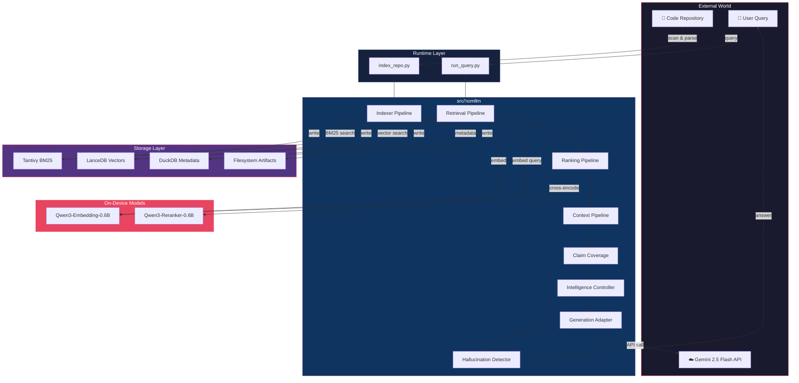

---

## 2. End-to-End Query Pipeline Flowchart

```mermaid
flowchart TD
    START(("🔍 User Query"))
    CONFIG["Config.from_file\ndefault.yaml"]
    INTENT["Intent Classification\nEXPLAIN | IMPLEMENT | REFACTOR\nDEBUG | SEARCH | UNKNOWN"]

    subgraph RETRIEVAL["Stage 1: Retrieval"]
        QE["Query Expansion\nmax_terms=6, synonyms"]
        PAR{"Parallel Search"}
        BM25["BM25 Search\nTantivy top_k=50"]
        VEC["Vector Search\nLanceDB top_k=50"]
        HYB["RRF Hybrid Merge\nk=10, bm25_w=0.5, vec_w=0.5"]
        PLANB{"Plan B\nEnabled?"}
        MMR_R["Diversity MMR\nλ=0.6"]
        GRAN["Granularity Boost\nIntent-specific tables"]
        GRAPH["Graph Stitch\nBFS depth=2, max=8"]
        KNEE["Adaptive Knee Gate"]
        PREC["Precision Recovery\nmax_additions=3"]
        COV["Coverage Recovery"]
    end

    subgraph RANKING["Stage 2: Ranking"]
        FEAT["Feature Enrichment\nname_match, struct_bonus"]
        GATE{"Reranker\nGating"}
        RERANK_S["Qwen3 Reranker\ntop_m=35 + BM25 rescue=15"]
        FUSE["Score Fusion\nw_base=1.0 + w_rerank=0.32\n+ w_struct=0.05"]
        DEDUP["Deduplication\nentropy_threshold=0.6"]
        SETOPT["Set Optimizer\n(optional)"]
    end

    subgraph CONTEXT["Stage 3: Context Assembly"]
        ASSEMBLE["Block Assembly"]
        SCORE_C["Block Scoring\n5-factor weighted"]
        COHERE["Coherence Refinement\nprotect top-3"]
        BUDGET{"Budget\nMode?"}
        SUBMOD["Submodular Packer\n4-component: rrf+novelty\n+graph+concept"]
        STD_BUD["Standard Budget\nTokenBudgetManager"]
        REFINE["Post-Allocation\nprecision filter | backfill\nclaim swap | evidence inject"]
        STITCH["Context Stitcher\n→ ContextArtifact"]
    end

    subgraph INTELLIGENCE["Stage 4: Intelligence"]
        DIAG["Diagnostics L1-L3"]
        ACT["Action Engines\n(propose only, no-op)"]
        CLAIM["Claim Coverage\ngate: PASS|WARN|BLOCK"]
        MECH["Mechanical Fixer\n(rule-based)"]
    end

    subgraph GENERATION["Stage 5: Generation"]
        TMPL["Template Loader\nexplain.yaml"]
        RENDER["Prompt Render\n+ reasoning enforcement"]
        LLM["Gemini 2.5 Flash\ntemp=0.0, max_out=2000"]
        HALLUC["Hallucination Detector\ncitation + identifier check"]
        PRESENT["PresentationRenderer\nnormalize + clean"]
    end

    ANSWER(("✅ Answer"))

    START --> CONFIG --> INTENT
    INTENT --> QE --> PAR
    PAR --> BM25 & VEC
    BM25 --> HYB
    VEC --> HYB
    HYB --> PLANB
    PLANB -->|yes| MMR_R --> GRAN --> GRAPH
    PLANB -->|no| KNEE
    GRAPH --> KNEE
    KNEE --> PREC --> COV

    COV --> FEAT --> GATE
    GATE -->|pass| RERANK_S --> FUSE
    GATE -->|skip| FUSE
    FUSE --> DEDUP --> SETOPT

    SETOPT --> ASSEMBLE --> SCORE_C --> COHERE --> BUDGET
    BUDGET -->|submodular| SUBMOD --> REFINE
    BUDGET -->|standard| STD_BUD --> REFINE
    REFINE --> STITCH

    STITCH --> DIAG --> ACT --> CLAIM --> MECH

    MECH --> TMPL --> RENDER --> LLM --> HALLUC --> PRESENT --> ANSWER

    style START fill:#e94560,color:#fff
    style ANSWER fill:#00b894,color:#fff
    style RETRIEVAL fill:#0f3460,color:#fff,stroke:#e94560
    style RANKING fill:#16213e,color:#fff,stroke:#e94560
    style CONTEXT fill:#1a1a2e,color:#fff,stroke:#e94560
    style INTELLIGENCE fill:#533483,color:#fff,stroke:#e94560
    style GENERATION fill:#2d3436,color:#fff,stroke:#e94560
```

---

## 3. Indexing Pipeline Flowchart

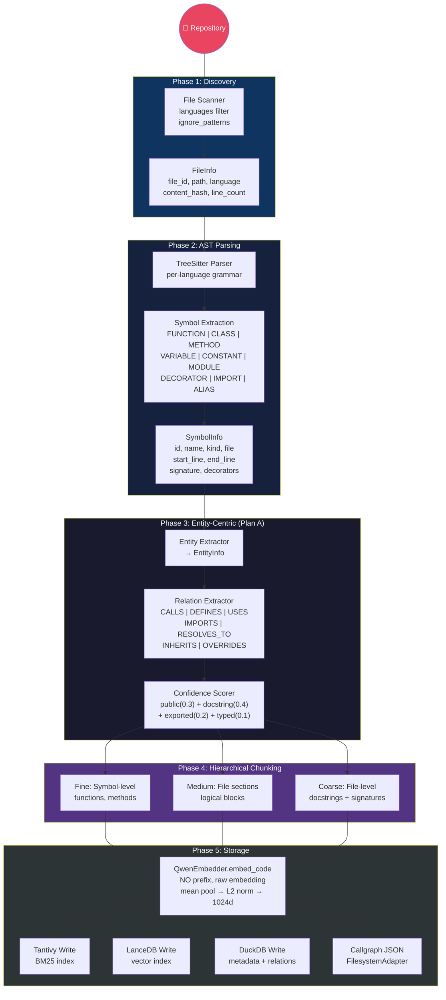

---

## 4. Retrieval Architecture Map

```mermaid
flowchart LR
    Q["Query + Intent"]

    subgraph PREP["Query Preparation"]
        QEX["Query Expansion\nsynonyms, camelCase split\nmax 6 terms"]
        QEMB["embed_query()\ninstruction prefix:\n'Represent this code\nsearch query for retrieval:'"]
    end

    subgraph SEARCH["Parallel Search"]
        BM25["BM25 Retriever\nTantivy\ntop_k=50"]
        VECTOR["Vector Retriever\nLanceDB cosine ANN\ntop_k=50"]
    end

    subgraph MERGE["Hybrid Merge"]
        RRF["RRF Fusion\nscore = Σ 1/(k+rank)\nk=10\nbm25_w=0.5, vec_w=0.5"]
    end

    subgraph PLANB["Plan B Extensions"]
        direction TB
        DIV["MMR Diversity\nλ=0.6, sim_thresh=0.85"]
        GB["Granularity Boost\nintent-specific tables"]
        GS["Graph Stitch\nBFS depth=2\nmax_additions=8\nbeam_high=8, beam_low=3"]
        HDEDUP["Hierarchical Dedup"]
        GMIX["Granularity Mixing\nfine/medium/coarse ratios"]
    end

    subgraph ADAPTIVE["Adaptive Recovery"]
        KNEE["Knee-Gate Detection\nscore drop-off analysis"]
        PR["Precision Recovery\nidentifier re-search\nmax=3, confidence≥0.8"]
        CR["Coverage Recovery\naspect backfill\nmax=3"]
        BAS["Budget-Aware Selection\nsingle-authority from\ncontext.max_tokens"]
    end

    Q --> QEX & QEMB
    QEX --> BM25
    QEMB --> VECTOR
    BM25 --> RRF
    VECTOR --> RRF
    RRF --> DIV --> GB --> GS --> HDEDUP --> GMIX
    GMIX --> KNEE --> PR --> CR --> BAS

    OUT(("Candidates\nto Ranking"))
    BAS --> OUT

    style Q fill:#e94560,color:#fff
    style OUT fill:#00b894,color:#fff
    style PREP fill:#0f3460,color:#fff
    style SEARCH fill:#16213e,color:#fff
    style MERGE fill:#1a1a2e,color:#fff
    style PLANB fill:#533483,color:#fff
    style ADAPTIVE fill:#2d3436,color:#fff
```

---

## 5. Ranking Pipeline Detail

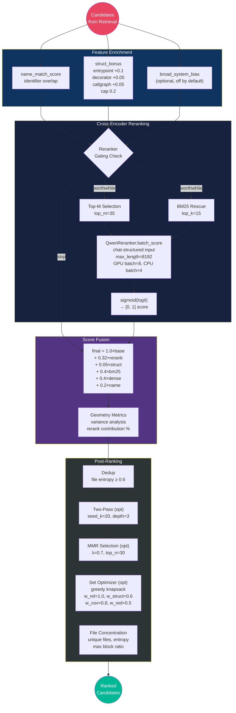

---

## 6. Context Assembly Architecture

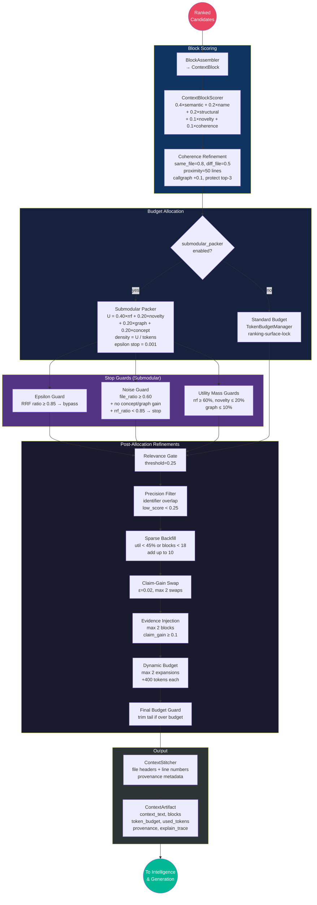

---

## 7. Intelligence & Generation Sequence

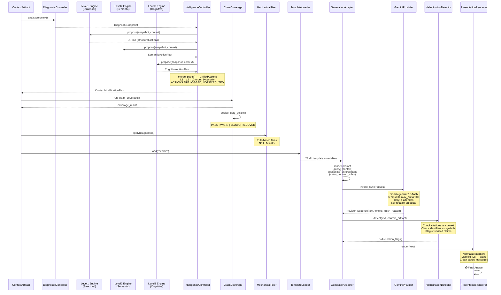

---

## 8. Storage Architecture Map

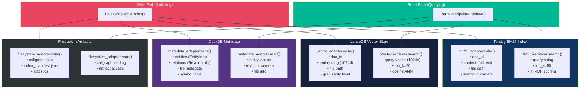

---

## 9. Model Call Map

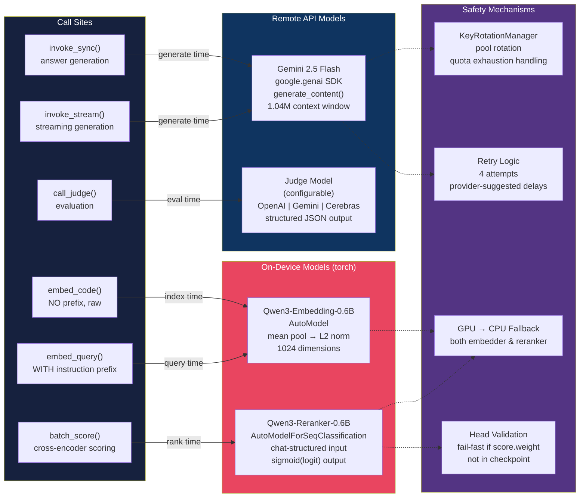

---

## 10. Scoring Pipeline Map

```mermaid
flowchart LR
    subgraph INDEX["Index-Time Scores"]
        S1["Entity Confidence\npublic(0.3) + doc(0.4)\n+ export(0.2) + type(0.1)"]
    end

    subgraph RETRIEVAL_S["Retrieval Scores"]
        S2["BM25 TF-IDF"]
        S3["Vector Cosine Sim"]
        S4["RRF Merge\nΣ 1/(k+rank)"]
        S5["MMR Diversity\nλ×sim - (1-λ)×max_sim"]
        S6["Granularity Boost\nintent-specific multiplier"]
    end

    subgraph RANKING_S["Ranking Scores"]
        S7["Feature Enrichment\nname_match + struct_bonus"]
        S8["Reranker Sigmoid\nsigmoid(cross-encoder logit)"]
        S9["Score Fusion\n1.0×base + 0.32×rerank\n+ 0.05×struct + 0.4×bm25\n+ 0.4×dense + 0.2×name"]
    end

    subgraph CONTEXT_S["Context Scores"]
        S10["Block Score\n0.4×sem + 0.2×name\n+ 0.2×struct + 0.1×nov\n+ 0.1×coh"]
        S11["Coherence Bonus\nsame_file(0.8)\ndiff_file(0.5)"]
        S12["Submodular Utility\n0.4×rrf + 0.2×novelty\n+ 0.2×graph + 0.2×concept"]
        S13["Submodular Density\nutility / token_count"]
        S14["Claim Gain\n(2×file_hits + 0.5×content)\n/ hint_terms"]
    end

    subgraph EVAL_S["Evaluation Scores"]
        S15["Judge Metrics\n8 dimensions × paired 1-5\n→ normalized 0-10"]
    end

    S1 --> S2 & S3
    S2 & S3 --> S4
    S4 --> S5 --> S6
    S6 --> S7
    S7 --> S8 --> S9
    S9 --> S10 --> S11 --> S12 --> S13
    S13 --> S14
    S14 --> S15

    style INDEX fill:#e94560,color:#fff
    style RETRIEVAL_S fill:#0f3460,color:#fff
    style RANKING_S fill:#16213e,color:#fff
    style CONTEXT_S fill:#533483,color:#fff
    style EVAL_S fill:#2d3436,color:#fff
```

---

## 11. Configuration Dependency Map

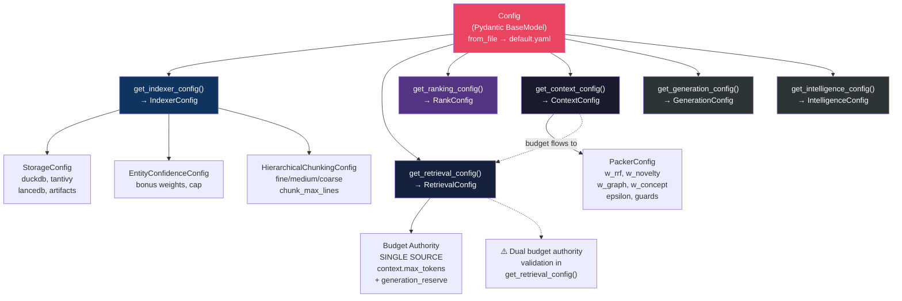

---

## 12. Embedding Asymmetry Diagram

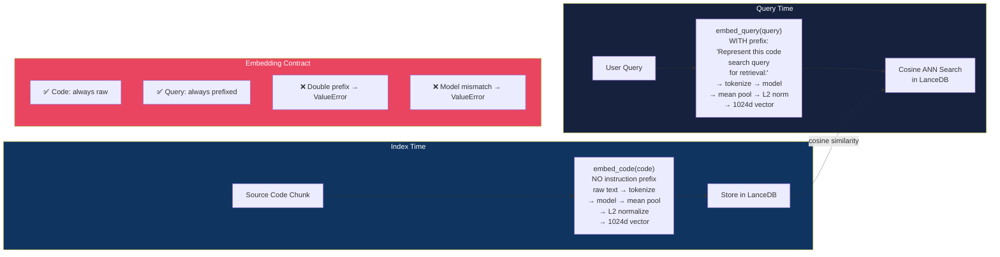

---

## 13. Telemetry Flow Map

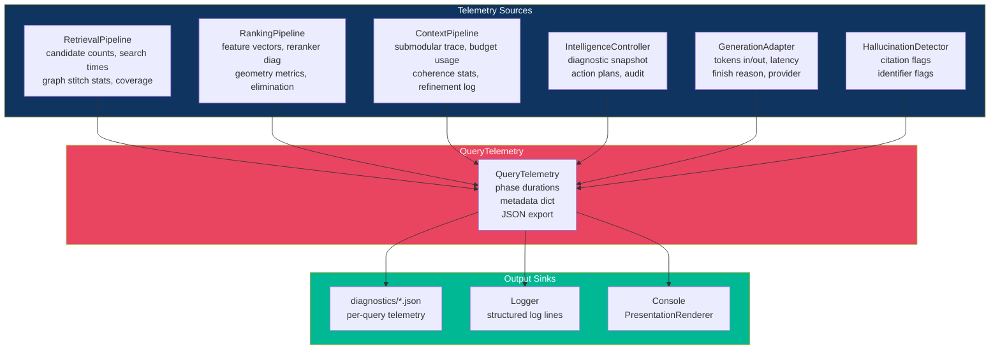

---

## 14. Agentic Insertion Points Map

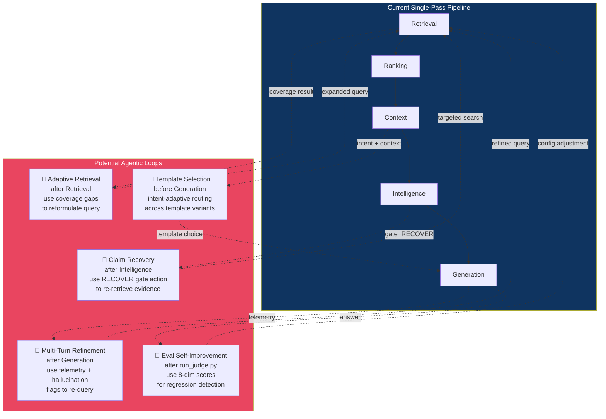
