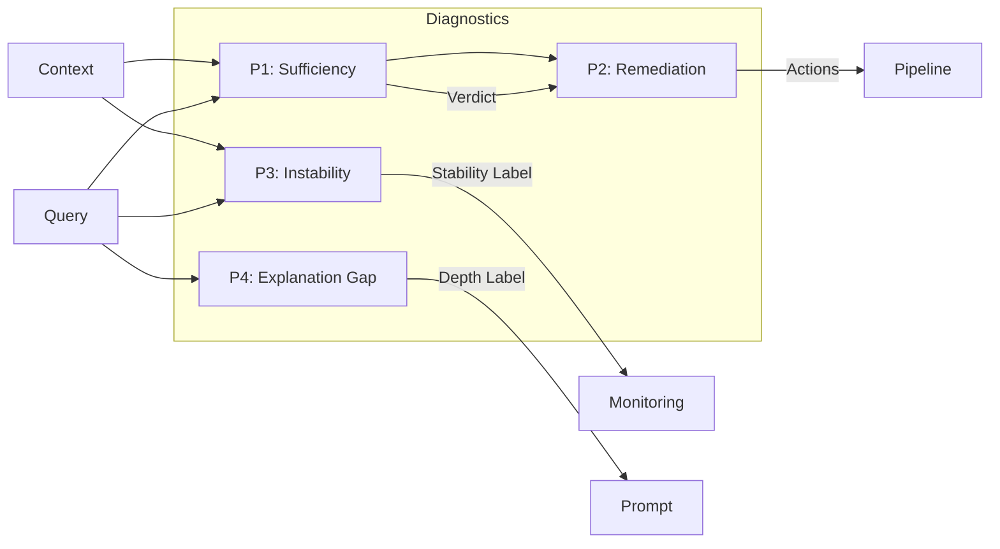
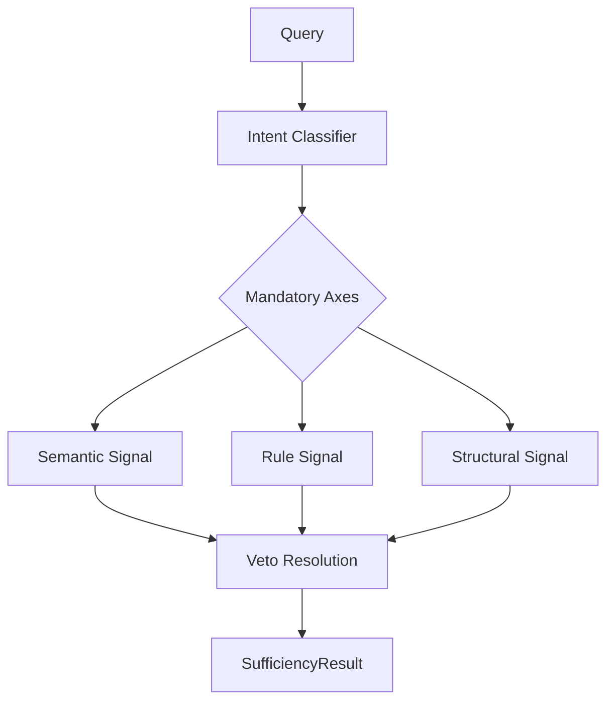
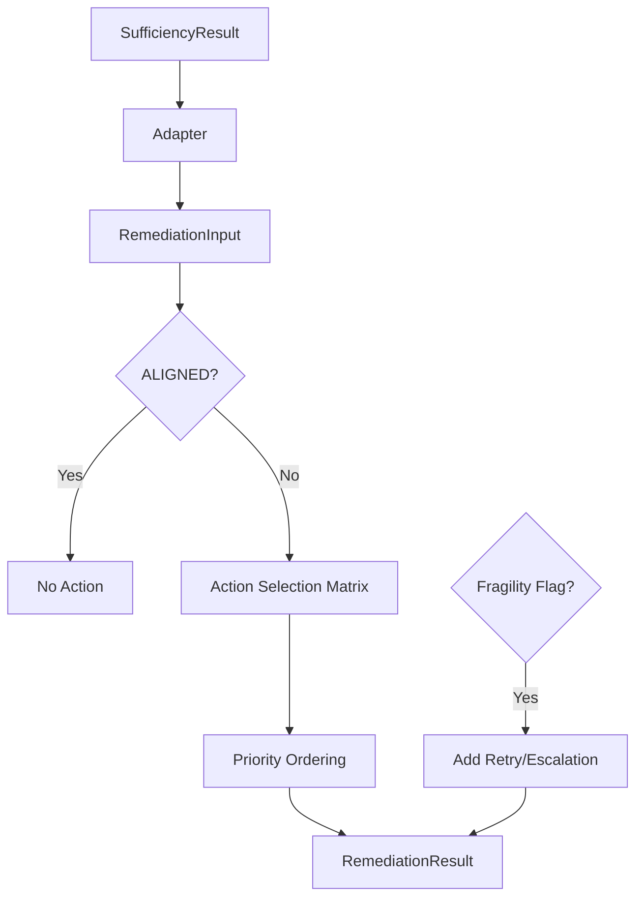
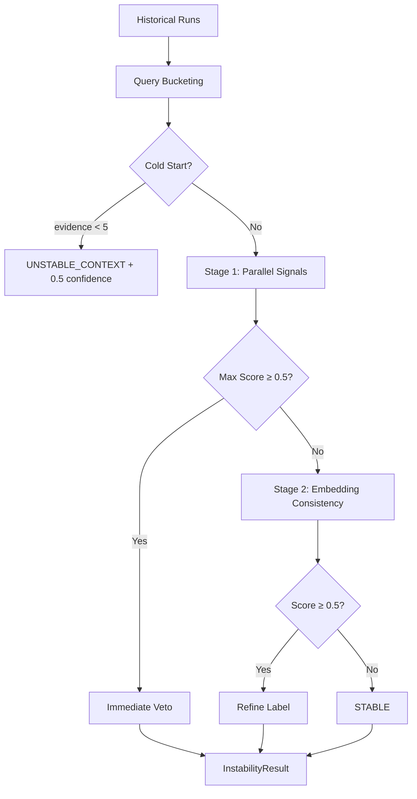
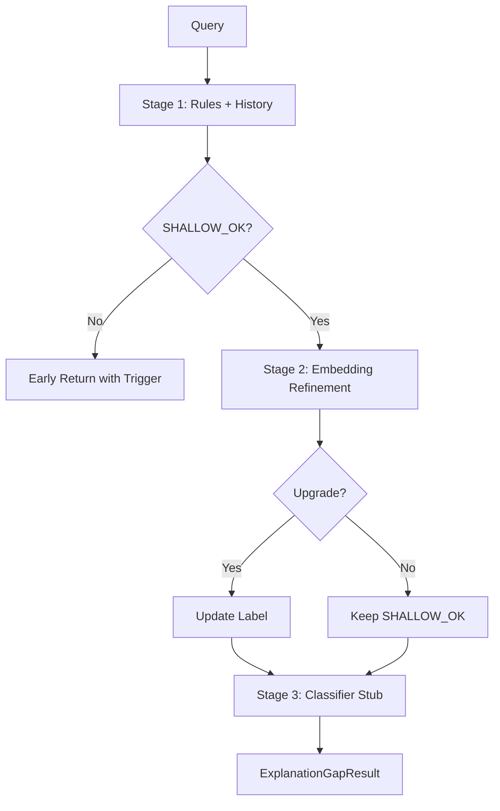

# HOM-LLM Diagnostic Systems Guide

This document provides a comprehensive overview of the four core diagnostic systems (P1–P4) implemented in HOM-LLM. These systems form the observability and quality assurance layer of the pipeline.

> [!IMPORTANT]
> All diagnostic systems are **read-only**. They do not modify context, prompts, retrieval, ranking, or generation. They emit advisory/diagnostic signals only.

---

## Overview

| Layer | Name | Location | Purpose |
|-------|------|----------|---------|
| **P1** | Sufficiency | `src/homllm/sufficiency/` | Evaluate context adequacy before generation |
| **P2** | Remediation | `src/homllm/remediation/` | Propose corrective actions from P1 diagnostics |
| **P3** | Instability | `src/homllm/instability/` | Detect cross-run variance patterns |
| **P4** | Explanation Gap | `src/homllm/explanation_gap/` | Recommend appropriate response depth |



---

## P1: Sufficiency Diagnostics

**Location**: [sufficiency/](file:///d:/HOM-LLM(v2.0)/src/homllm/sufficiency/)

### Purpose
Determines whether the assembled context is sufficient to answer the given query. Emits a verdict and identifies which axis caused any failure.

### Pipeline Flow



### Intent Classification

The non-LLM intent classifier determines which sufficiency axes are mandatory based on query patterns:

| Intent | Mandatory Axes | Early Exit | Pattern Examples |
|--------|---------------|------------|------------------|
| ARCHITECTURAL | STRUCTURAL, SEMANTIC | ❌ | "execution flow", "layers", "priority order" |
| IMPLEMENTATION | RULE, STRUCTURAL, SEMANTIC | ✅ | "how does X work", "what happens when" |
| BEHAVIORAL | RULE, SEMANTIC | ✅ | "behavior when", "callers wait" |
| UNKNOWN | All three | ❌ | (conservative default) |

### Sufficiency Signals

#### 1. Semantic Signal
**File**: [semantic.py](file:///d:/HOM-LLM(v2.0)/src/homllm/sufficiency/signals/semantic.py)

| Metric | Description | Weight |
|--------|-------------|--------|
| Centroid Similarity | Query embedding vs. context centroid | 70% |
| Diversity | Mean pairwise distance of block embeddings | 30% |

- **Threshold**: Score ≥ 0.80 → SUFFICIENT
- **Authority**: Soft veto only (downgrades to PROBABLY_SUFFICIENT, not INSUFFICIENT)

#### 2. Rule Signal
**File**: [rule.py](file:///d:/HOM-LLM(v2.0)/src/homllm/sufficiency/signals/rule.py)

| Metric | Description |
|--------|-------------|
| Term Overlap | Identifier/n-gram overlap between query and context |

- **Threshold**: Score ≥ 0.30 → SUFFICIENT
- **Authority**: Hard veto when mandatory

#### 3. Structural Signal
**File**: [structural.py](file:///d:/HOM-LLM(v2.0)/src/homllm/sufficiency/signals/structural.py)

| Metric | Points |
|--------|--------|
| ≥1 blocks | +0.3 |
| ≥2 blocks | +0.2 |
| Has symbols | +0.3 |
| ≥1 distinct files | +0.1 |
| ≥2 distinct files | +0.1 |
| ≥1 code blocks | +0.2 |

- **Threshold**: Score ≥ 0.50 → SUFFICIENT
- **Authority**: Hard veto when mandatory

### Veto Resolution

**File**: [veto.py](file:///d:/HOM-LLM(v2.0)/src/homllm/sufficiency/veto.py)

Veto hierarchy (AND-logic, checked in order):
1. **STRUCTURAL** → Hard veto → INSUFFICIENT
2. **RULE** → Hard veto → INSUFFICIENT
3. **SEMANTIC** → Soft veto → PROBABLY_SUFFICIENT

### Output Contract

```python
@dataclass(frozen=True)
class SufficiencyResult:
    final_verdict: VerdictType  # SUFFICIENT | PROBABLY_SUFFICIENT | INSUFFICIENT
    deciding_factor: AxisType | None  # STRUCTURAL | RULE | SEMANTIC
    intent: IntentType
    signals: dict[str, SignalResult]
```

---

## P2: Remediation Diagnostics

**Location**: [remediation/](file:///d:/HOM-LLM(v2.0)/src/homllm/remediation/)

### Purpose
Consumes P1 diagnostics and proposes bounded, attributable corrective actions. Does not execute actions—only recommends.

### Pipeline Flow



### Action Selection Matrix

| Deciding Factor | Action Type | Expected Effect |
|-----------------|-------------|-----------------|
| STRUCTURAL | RETRIEVAL_EXPANSION | Expand retrieval scope (README/docs, parent dirs) |
| RULE | RETRIEVAL_RE_TARGET | Re-target retrieval to correct subsystem |
| SEMANTIC | TOKEN_BUDGET_INCREASE | Increase token ceiling for multi-pass assembly |
| *fragility_flag* | RETRY_ESCALATION | Retry with expanded constraints or surface warning |

### Action Priority Order

Actions are applied in this order (Structural first):
1. `RETRIEVAL_EXPANSION`
2. `RETRIEVAL_RE_TARGET`
3. `TOKEN_BUDGET_INCREASE`
4. `PROMPT_STRATEGY`
5. `RETRY_ESCALATION`

### Label Mapping (P1 → P2)

| P1 Verdict | P2 Label |
|------------|----------|
| SUFFICIENT | ALIGNED |
| PROBABLY_SUFFICIENT | PARTIALLY_ALIGNED |
| INSUFFICIENT | MISALIGNED |

### Output Contract

```python
@dataclass(frozen=True)
class RemediationResult:
    actions: tuple[RemediationAction, ...]
    trigger_to_actions: tuple[tuple[str, ActionType], ...]
```

---

## P3: Instability Diagnostics

**Location**: [instability/](file:///d:/HOM-LLM(v2.0)/src/homllm/instability/)

### Purpose
Detects cross-run variance in context and reasoning. Identifies whether instability is in the **context layer** (retrieval inconsistency) or **reasoning layer** (generation inconsistency).

### Pipeline Flow



### Instability Signals

#### Stage 1 Signals (Parallel Evaluation)

| Signal | File | Measures | Label |
|--------|------|----------|-------|
| **Retrieval Overlap** | [retrieval_overlap.py](file:///d:/HOM-LLM(v2.0)/src/homllm/instability/signals/retrieval_overlap.py) | Jaccard similarity of chunk IDs across runs | UNSTABLE_CONTEXT |
| **Metadata Variance** | [metadata_variance.py](file:///d:/HOM-LLM(v2.0)/src/homllm/instability/signals/metadata_variance.py) | Variance in file-type distribution and run size | UNSTABLE_CONTEXT |
| **Failure Frequency** | [failure_frequency.py](file:///d:/HOM-LLM(v2.0)/src/homllm/instability/signals/failure_frequency.py) | Rate of P1 failures (raw runs only, anti-amplification) | UNSTABLE_CONTEXT |
| **Answer Structure** | [answer_structure.py](file:///d:/HOM-LLM(v2.0)/src/homllm/instability/signals/answer_structure.py) | Variance in token count, sections, code blocks, lists, refusals | UNSTABLE_REASONING |

#### Stage 2 Signal (Refinement)

| Signal | File | Measures | Label |
|--------|------|----------|-------|
| **Embedding Consistency** | [embedding_consistency.py](file:///d:/HOM-LLM(v2.0)/src/homllm/instability/signals/embedding_consistency.py) | Variance of context centroid embeddings | UNSTABLE_CONTEXT |

### Signal Details

#### Retrieval Overlap
- Computes pairwise Jaccard similarity on chunk IDs
- Score = 1 - mean_jaccard (low overlap → high instability)
- **Threshold**: Score > 0.5 → UNSTABLE_CONTEXT

#### Answer Structure Variance
Captures five structural metrics:

| Metric | Description |
|--------|-------------|
| Token Count | Word count variance across answers |
| Section Count | Header/section count variance |
| Code Blocks | Presence/absence of ``` or indented code |
| List Density | Proportion of list lines |
| Refusal Markers | Count of "not in context", "I cannot", etc. |

Score = average of normalized variances across all metrics.

### Constants

| Constant | Value | Description |
|----------|-------|-------------|
| COLD_START_MIN_RUNS | 5 | Minimum runs for reliable analysis |
| BUCKET_EMBEDDING_SIMILARITY_THRESHOLD | 0.85 | Query similarity for same bucket |
| VETO_THRESHOLD | 0.5 | Score threshold for immediate veto |
| SECONDARY_CONTRIBUTOR_THRESHOLD | 0.3 | Threshold for secondary signal attribution |

### Output Contract

```python
@dataclass(frozen=True)
class InstabilityResult:
    primary_label: PrimaryLabelType  # STABLE | UNSTABLE_CONTEXT | UNSTABLE_REASONING
    confidence: float
    evidence_volume: int
    explanation: dict[str, float]  # per-signal scores
    primary_deciding_signal: str
    secondary_contributors: tuple[str, ...]
    cold_start: bool
    per_signal_scores: tuple[SignalScore, ...]
    thresholds_triggered: tuple[str, ...]
```

---

## P4: Explanation Gap Diagnostics

**Location**: [explanation_gap/](file:///d:/HOM-LLM(v2.0)/src/homllm/explanation_gap/)

### Purpose
Detects whether a query requires a shallow factual response, detailed explanation, or concrete examples. Provides advisory depth recommendations for prompt construction.

### Pipeline Flow



### Depth Labels (Severity Order)

| Label | Severity | Description |
|-------|----------|-------------|
| EXAMPLE_RECOMMENDED | Highest | Query needs concrete code examples |
| DETAILED_REQUIRED | Medium | Query needs step-by-step explanation |
| SHALLOW_OK | Lowest | Simple factual answer is sufficient |

**Escalation Rule**: Labels can only escalate upward, never downgrade.

### Stage 1: Rule-Based Patterns

**File**: [rules.py](file:///d:/HOM-LLM(v2.0)/src/homllm/explanation_gap/rules.py)

| Intent | Default Label | Pattern Triggers |
|--------|--------------|------------------|
| ILLUSTRATIVE | EXAMPLE_RECOMMENDED | "show me", "example", "sample code", "demonstrate" |
| EXPLANATORY | DETAILED_REQUIRED | "why", "how does", "explain", "step by step" |
| DEBUGGING | DETAILED_REQUIRED | "error", "exception", "fails", "edge case" |
| FACTUAL | SHALLOW_OK | (default when no patterns match) |

### Stage 1: Historical Depth

**File**: [history.py](file:///d:/HOM-LLM(v2.0)/src/homllm/explanation_gap/history.py)

Uses historical statistics per query bucket:

| Metric | Threshold | Effect |
|--------|-----------|--------|
| pct_expanded_or_manual | ≥ 30% | Escalate to DETAILED_REQUIRED |
| pct_shallow_complaints | ≥ 30% | Escalate to DETAILED_REQUIRED |

Cold-start (< 2 runs in bucket) → no historical escalation.

### Stage 2: Embedding Refinement

**File**: [embedding_refinement.py](file:///d:/HOM-LLM(v2.0)/src/homllm/explanation_gap/embedding_refinement.py)

Only runs when Stage 1 result is SHALLOW_OK.

Compares query embedding to intent centroids:
- **Illustrative centroid**: "show me an example with code sample"
- **Explanatory centroid**: "explain why and how it works step by step"
- **Factual centroid**: "what is the definition"

| Similarity | Threshold | Action |
|------------|-----------|--------|
| sim_illustrative ≥ 0.6 (highest) | Upgrade to EXAMPLE_RECOMMENDED |
| sim_explanatory ≥ 0.6 | Upgrade to DETAILED_REQUIRED |
| Below threshold | Keep SHALLOW_OK |

### Stage 3: Classifier Stub

**File**: [classifier_stub.py](file:///d:/HOM-LLM(v2.0)/src/homllm/explanation_gap/classifier_stub.py)

Optional upgrade-only classifier (currently a no-op stub). Can be replaced with ML classifier in future.

### Constants

| Constant | Value | Description |
|----------|-------|-------------|
| COLD_START_CONFIDENCE | 0.5 | Confidence when evidence_volume < 2 |
| HISTORY_ESCALATION_PCT | 0.3 | 30% threshold for historical escalation |
| EMBEDDING_UPGRADE_THRESHOLD | 0.6 | Cosine similarity threshold for upgrade |

### Output Contract

```python
@dataclass(frozen=True)
class ExplanationGapResult:
    label: DepthLabelType  # SHALLOW_OK | DETAILED_REQUIRED | EXAMPLE_RECOMMENDED
    confidence: float
    evidence_volume: int
    rationale: str
    deciding_trigger: str
    per_signal_outputs: tuple[SignalOutput, ...]
    cold_start: bool
```

---

## Integration with Current System

### Usage Patterns

```python
# P1: Sufficiency check before generation
from homllm.sufficiency import run_sufficiency
result = run_sufficiency(query, context_artifact, embedder)

# P2: Get remediation actions from P1 result
from homllm.remediation import run_remediation_from_sufficiency
actions = run_remediation_from_sufficiency(result, fragility_flag=False)

# P3: Instability analysis over historical runs
from homllm.instability import run_instability
stability = run_instability(runs, intent, reference_embedding)

# P4: Explanation gap for prompt depth
from homllm.explanation_gap import run_explanation_gap_with_embedder
depth = run_explanation_gap_with_embedder(query, embedder, history_stats)
```

### Diagnostic Layers in Pipeline

The diagnostics can be enabled via command-line flags:

```bash
# Run with P1-P4 sufficiency diagnostics
python -m runtime.run_query --diagnostic-layers p1,p2,p3,p4

# Run with L1-L3 context diagnostics
python -m runtime.run_query --context-diagnostics
```

### Key Benefits

| System | Benefit |
|--------|---------|
| **P1 Sufficiency** | Prevents generation when context is inadequate |
| **P2 Remediation** | Provides actionable suggestions for context improvement |
| **P3 Instability** | Identifies flaky queries and retrieval inconsistencies |
| **P4 Explanation Gap** | Optimizes response depth for user intent |

---

## Design Principles

All four diagnostic systems adhere to these principles:

1. **Read-Only**: No mutation of context, prompts, or generation
2. **Deterministic**: No learning loops, no runtime mutation of thresholds
3. **No LLM Calls**: All signals use embeddings or rule-based patterns
4. **Conservative Bias**: Ambiguity → escalate/fail-safe
5. **Auditability**: All decisions include attribution and per-signal scores
6. **Frozen Contracts**: Output structures are immutable dataclasses
